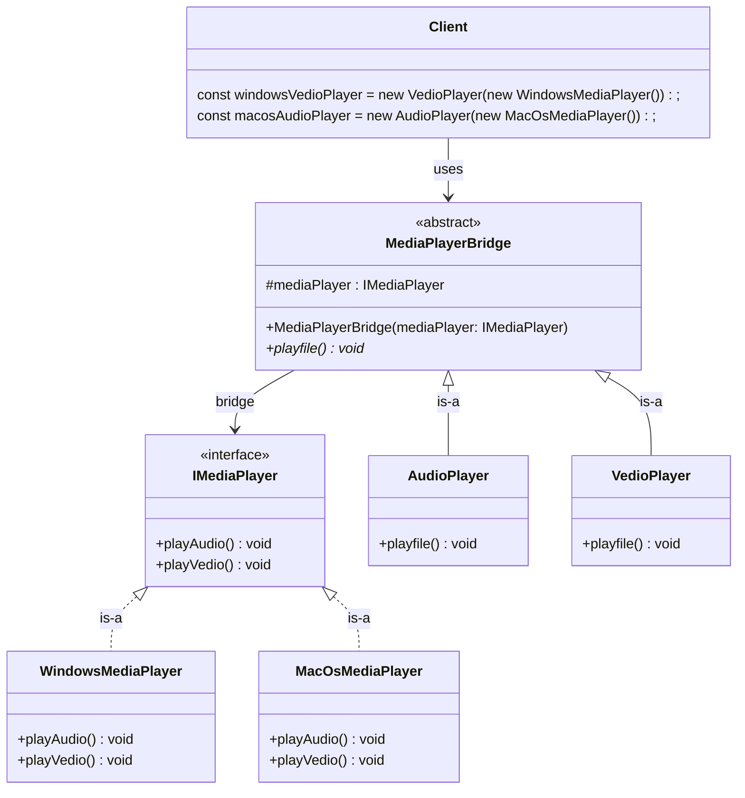

# Bridge Pattern

```mermaid
classDiagram

    class IMediaPlayer {
        <<interface>>
        +playAudio() void
        +playVedio() void
    }

    class MediaPlayerBridge {
        <<abstract>>
        #mediaPlayer : IMediaPlayer
        +MediaPlayerBridge(mediaPlayer: IMediaPlayer)
        +playfile() void*
    }

    class AudioPlayer {
        +playfile() void
    }

    class VedioPlayer {
        +playfile() void
    }

    class WindowsMediaPlayer {
        +playAudio() void
        +playVedio() void
    }

    class MacOsMediaPlayer {
        +playAudio() void
        +playVedio() void
    }

    class Client {
        const windowsVedioPlayer = new VedioPlayer(new WindowsMediaPlayer());
        const macosAudioPlayer = new AudioPlayer(new MacOsMediaPlayer());
    }

    IMediaPlayer <|.. WindowsMediaPlayer : is-a
    IMediaPlayer <|.. MacOsMediaPlayer : is-a

    MediaPlayerBridge <|-- AudioPlayer : is-a
    MediaPlayerBridge <|-- VedioPlayer : is-a

    MediaPlayerBridge --> IMediaPlayer : bridge

    Client --> MediaPlayerBridge : uses
```